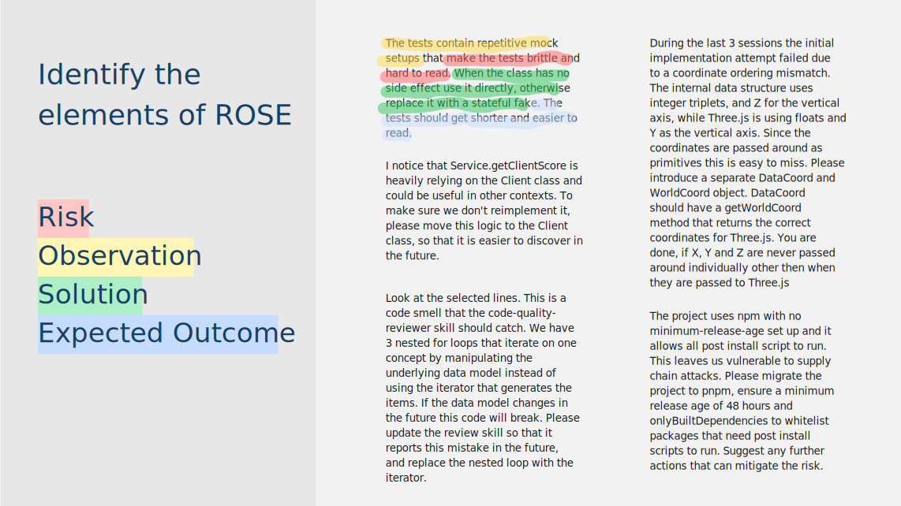

# {{ page.title}}

When giving feedback to an AI, focusing only on the desired action risks the AI not understanding your goal and finding solutions that feel like malicious compliance. Emphasising the risks and the desired outcomes leads to better results.

## Learning Goals

* Recognise the four elements of ROSE feedback in a prompt: Risk, Observation, Solution, Expected outcome.
* Write ROSE feedback that steers an agent's solution towards what you actually want.

## Session Outline

* 10 min connect: Blind drawing
* 5 min concept: The ROSE feedback pattern 
* 10 min concrete: Active reading
* 25 min concrete: Write ROSE prompts for the Tennis kata
* 10 min conclusions: Explain the main idea

### Connect: Blind drawing

Ask participants to grab some sticky notes and draw these things in sequence:

1. Draw a horizontal line at the bottom
2. Above it draw two rectangles inside each other
3. Above that draw a triangle
4. Next to the triangle draw a large circle

Congratulate the team on the amazing artworks, and reveal the image you've been describing:

{:.centered-image}

Ask the team:
* What went wrong? Why did you end up with very different results?
* What did I *not* tell you that would have made our drawings match?

The point: the same gap appears when you give a coding agent solution-focused feedback. The agent is not aware of your goal, so it follows the actions faithfully yet still misses the goal.

### Concept: The ROSE feedback pattern

Use ROSE once the agent has already produced a solution, but you want it to change something.

- **Risk**: the long-term consequence or negative impact of the current approach. (*e.g. "Brittle, hard-to-read tests lead to a maintenance burden."*)
- **Observation**: what you see in the code or work that causes that risk. (*e.g. "Repetitive mock setups show up in every test as irrelevant detail."*)
- **Solution**: the specific action you want the agent to take. (*e.g. "Where the class has no side effects, use it directly; otherwise replace the mock with a stateful fake."*)
- **Expected outcome**: what success looks like - the benefit you expect. (*e.g. "The tests get shorter and easier to read."*)

The elements don't have to appear in R-O-S-E order, and you won't always need all four. Most people include only the Solution in the prompt.

Observation can be phrased as "Look at the selected line" when the agent supports reading code selected in the IDE. 

Distinction between Risk and Expected outcome:
- Risk focuses on tangible negative impacts that are typically long-term and may not necessarily materialise.
- Expected outcome focuses on immediate benefits or changes in metrics that the agent can easily validate.

### Concrete: ROSE in practice

#### Active reading (10 min)

Grab four different coloured highlighters and label the **R**isk, **O**bservation, **S**olution and **E**xpected outcome parts of each prompt.

Use this handout for the prompts: [Open full size](../../assets/images/rose_pattern_handout.svg){:target="_blank" rel="noopener"}

{:.centered-image}

**Note to the facilitator:** It's not that important if participants highlight each section correctly. The purpose of the exercise is to make them analyse each prompt actively. Nonetheless, encourage them at the end by saying that they did a good job.

#### Write ROSE prompts for the Tennis kata (25 min)

1. Open [TennisGame2 from the Tennis Refactoring Kata]() and read the code.
2. Identify some issues with the code.
3. Treating the code as output you received from an agent, write a ROSE-structured prompt to give the agent feedback.
4. *(Optional, if time allows)* Send your prompt to a coding agent and see whether it steers the result the way you intended.

### Conclusions: Explain the main idea

Ask people to [explain the main idea]() of the ROSE feedback pattern in their own words, for example:

* What does each letter of ROSE add to a prompt?
