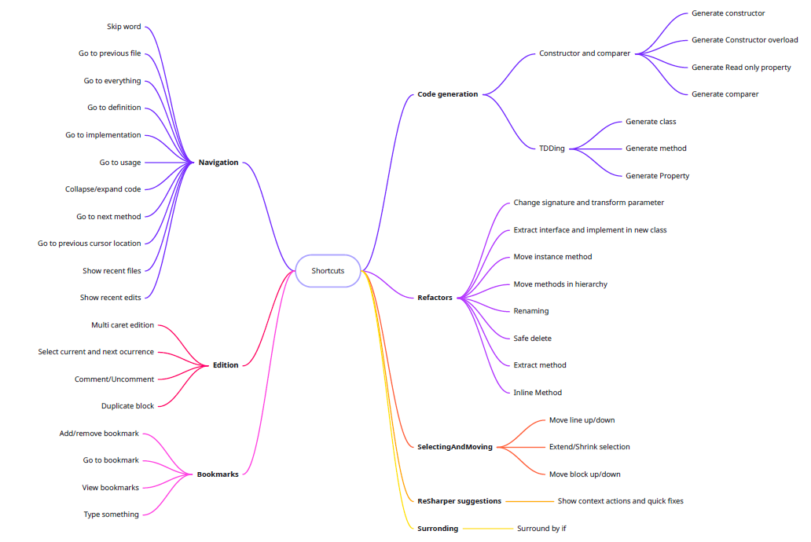

# Visual Studio + ReSharper and Rider Shortcuts

This learning hour is all about exercising shortcuts to explore the possibilities we have inside an IDE. Because of that, it's very tool specific, specifically on Visual Studio with ReSharper and with JetBrains Rider, in both cases using the Visual Studio keyboard scheme.

The session could be long, as there are plenty of shortcuts to demo and practice. If you want to go through all of them, you may need to split the learning hour in two consecutive sessions, but if the team is already familiar with several, you can focus on the ones they are less familiar with.

In case you split the session in two, I propose two different connect exercises to add some diversity.

## Session Outline
 
* 5 min connect: Exchange preferred shortcuts
* 10 min Setup: Ensure everyone has the right keyboard scheme and scan the map of shortcuts
* 40 min demo+concrete: Use the shortcuts to solve different exercises and ask people to do the same    
* 5 min conclusions: Which shortcuts do people take away?

### Connect
* Option 1 (preferred) - What are the keyboard shortcuts that you use the most while coding?
* Option 2 - What are the activities you've seen people using shortcuts for, you wish you knew the shortcut?

### Setup
#### Checkout
Ask everyone to checkout the [repo](https://github.com/xrecoba/VS-ReSharper-shortcuts) with the exercise. In opposition to most LHs, the recommendation for this one is that everyone does it individually to develop muscle memory.

#### Align keymap
Explain that the exercise has been setup with the Visual Studio keymap both for VS+ReSharper and Rider. Of course, everyone is entitled to use their preferred keymap but if someone uses a different one, they will have to look up by themselves the key combinations for the shortcuts they are not familiar with.

For anyone willing to use the Visual Studio keymap, explain how to validate they are already using it or how they can set it up by going to:
* Visual Studio + ReSharper - Going to Extensions --> ReSharper --> Options --> Keyboard Scheme
* Rider - File --> Settings --> Keymap

#### Explain dynamic
Display the map of shortcuts and explain everyone that during the session, you'll be going through each of these blocks and demoing how to solve small exercises using a shortcut (or a combination of).

It is recommended to setup the presentation mode in Rider or to install the [ShowTheShortcut]([https://github.com/madskristensen/ShowTheShortcut]) extension in Visual Studio so the tool can highlight which shortcuts are you using at the right time.     
 

### Demo + Concrete
For each block in the shorcuts map, open the corresponding file and go through the different exercises inside. While screen sharing, solve the exercise using the shortcut and explain what you do with special emphasis on the key combinations you use. Afterwards, leave time to the group to try on their own machines (as already said, individually, everyone should practice on their own).

### Conclusions
Ask people to discuss in pairs: What are your takeaways from today's shortcuts? 

Create 5 categories so they can put post-its on them with the takeaways:
* New favourite 😍
* Useful 👍
* Unexpected 😯
* Meh 😒
* I'll stick to the mouse 🐁

When closing, suggest anyone excited about the learnings to download the [JetBrains Cheatsheet](https://resources.jetbrains.com/storage/products/resharper/docs/ReSharper_DefaultKeymap_VSscheme.pdf), print it, put it underneath their keyboard and unplug the mouse for a whole week 😁.

